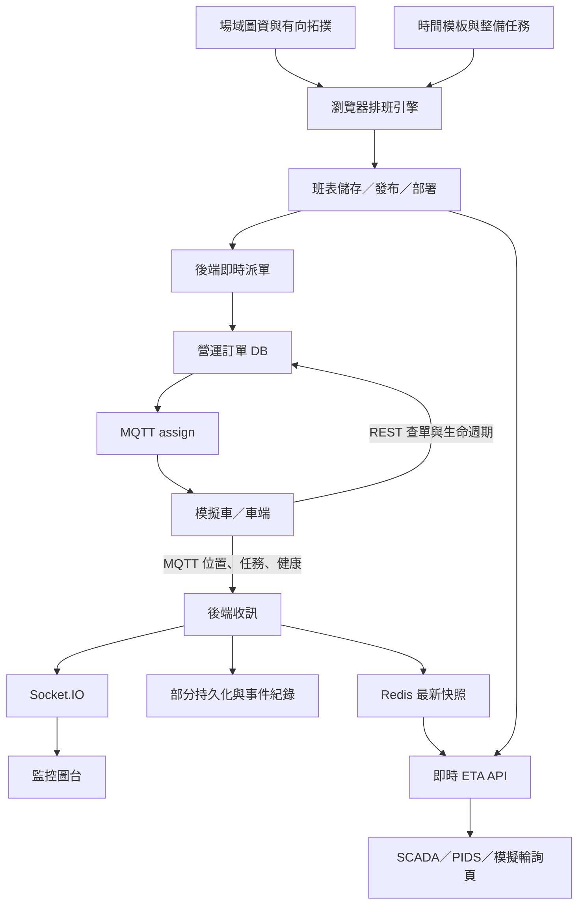

# SyncDrive T3 與 Simulator 研究及改善建議

研究日期：2026-09-17。對象為本機兩個專案的目前工作目錄，包含研究開始前已存在的未提交修改。

## 1. 結論與研究範圍

SyncDrive T3 是 T3 場域的車隊營運管理平台：把圖資、路線、時間模板與整備需求轉成班表，部署後由中心端派發訂單，接收車端狀態，再供操作員圖台與外部 ETA 使用方查閱。Simulator 是獨立的車端／外部使用方測試工具，不是排班引擎，也不是完整自駕或交通物理模擬器。

已有相當完整的功能骨架，尤其圖資編輯、排班限制、資料流與對外介面。不過目前仍混合正式功能、示範功能與開發期捷徑，不能以「11 台車在圖台上移動」判定營運閉環已可靠。

本次讀取文件索引、架構與功能說明、排班算法審核文件、點位拓撲、儲存架構、即時調度草案、車端介接及相關協議，並追查前後端與模擬器主要執行路徑、部署設定及測試。對已有 Markdown 版本的文件以 Markdown 為主，未逐頁比對全部 Word 附件，也未逐行審計所有 UI／歷史腳本。本報告區分程式確認、離線重現與現場驗證。2026-09-18 已在備份與回滾機制下部署到 GCP，完成 REST、MQTT mTLS、PMS99 測試頁與訂單生命週期驗證；結果見 §8.1。

## 2. 兩包程式分別做什麼

| 部分 | 實際職責 | 主要位置 |
|---|---|---|
| 操作介面 | 模組側欄、圖台與儀表板編排、營運操作頁面，中英文切換 | frontend/src/features/schedule-management、dashboard |
| 地圖編輯 | 場域、軌道、站點、設施、交叉軌道、OpenDRIVE、圖面與實地座標、拓撲與路線 | frontend/src/features/map-editor |
| 載具外觀 | 車身、燈號、門及車輛圖示的定義與編輯 | frontend/src/features/vehicle-editor |
| 營運規劃 | 時間模板、整備任務、路線關係、生成與人工調整班表、發布檢查 | frontend/src/features/time-templates、maintenance-tasks、shift-list |
| 營運執行 | 部署班表、展開今日工作、依時刻建立訂單、回報生命週期 | backend/src/operation-shift、dispatch、order |
| 即時資料 | MQTT 收訊、Redis 最新狀態、Socket.IO 推播、部分資料持久化 | backend/src/mqtt、redis、events |
| 對外供應 | 班表／站點計畫時間、依車／依站即時 ETA、車端訂單查詢與回報 | backend/src/vehicle/eta、operation-shift、order |
| 通訊與維運 | API 金鑰、車輛憑證、系統健康、稽核、Docker 與 nginx | backend/src/partner-access、system-health、audit；deploy |
| 模擬車隊 | 每車 MQTT 連線、接單、路徑運動、狀態與異常回報 | simulator/src/fleet.js、vehicle.js |
| 模擬控制台 | 切換目標、憑證更新、車隊控制、事件紀錄、ETA 輪詢 | simulator/server.js、public、src/etaPoller.js |
| 模擬路徑編輯 | 收圖、人工路徑、軌道尋路、圖面與實地換算 | simulator/src/map*、routePaths.js、trackRouter.js、web |

技術組合是 React／TypeScript／Vite 前端、NestJS／TypeORM 後端、PostgreSQL／TimescaleDB、Redis、Mosquitto、Socket.IO、nginx／Docker Compose。模擬器主服務使用 Node.js 原生 HTTP 與 MQTT；路徑編輯頁另用 React 建置。

## 3. 核心流程與邊界

### 3.1 圖資不是單一座標系

圖面像素與現場公尺分開；每個場域方塊可能有自己的映射，生成軌道還有 real/local 中心線。因此不能拿整張圖做一次線性縮放便期待所有車都準確落軌。

點位拓撲是有向圖，記錄站點／途經點／設施之間的最快時間、平均時間與距離。路線提供站序；排班保存站間時間快照，再分配逐站到離時間。模擬器的幾何軌道尋路與排班的時間拓撲不是同一件事：前者決定在哪裡移動，後者決定計畫需要多久。

### 3.2 排班引擎在前端，即時派單在後端

排班主入口位於 [generate.ts](/Users/arlen/Desktop/development/syncdrive_t3/frontend/src/features/shift-list/utils/schedule-engine/generate.ts:138)。它不是單純把班次平均排開，而是：

1. 正規化模板、路線、班距、整備與拓撲輸入。
2. 展開各時間線任務與載客班次，處理路線輪替及出入廠銜接。
3. 插入整備銜接、調度與等待相關區塊。
4. 重複修正站位佔用、碰撞保護、班距、位置連續性與設施停放。
5. 各修正步驟以共同分數檢查，變差則撤回；最多 14 輪，保留較佳結果。
6. 執行驗證並輸出班表、問題與分析報表。

這是帶多道修復與評分的啟發式排程，不是能證明全域最佳解的求解器。「有輸出」不等於「所有約束都通過」，必須一起看驗證結果。

後端即時引擎讀取 `usage_status=in_use` 的班表，展開載客、空車移動與整備訂單；設定預設每 5 秒檢查，提前 90 秒派單，漏跑後允許 300 秒補建立窗口。時間線列以啟用車輛排序後的位置對應車號。目前沒有固定營運日的角色綁定與完整誤點接管策略。

注意：正式 Compose 預設 DISPATCH_ENABLED=false，但程式 dispatch.config.ts 在環境變數缺漏時預設 true；「預設關閉」只在指定部署設定成立。

### 3.3 訂單與狀態

中心端先存營運訂單，MQTT assign 僅通知 order_id。車端以外部 REST 拉內容、回報 processing/end，再以 MQTT 回報位置、任務進度與健康。狀態模型含 PENDING、PROCESSING、END、FAULTED。

車端不直接讀班表是合理邊界，應保留。中心端應提供工作契約，車端負責執行；目前 ACK、重送、去重與恢復語意還不完整，見後文。

### 3.4 即時 ETA 的來源

第一個目標站主要採車端 `current_leg.eta_seconds`，後端做資料新鮮度、進站狀態、計畫對照與延遲分類；並提供依車、依站兩種視角。這不是中心端依道路交通獨立求出的 ETA 模型。

### 3.5 Simulator 的可信範圍

目前可驗證 MQTT／REST 基本串接、車號與 Topic、接單和回報格式、圖面位置、路徑映射，以及外部 API 輪詢。

但不宜直接用來證明：真實發車準點性、完整停靠開關門流程、碰撞避免、失聯復原、完整指令執行、加速度與電量模型。主要原因是它以牆鐘經過時間除以計畫時長沿折線移動；未做完整逐站停留狀態機，進出場可直接停進格位，尋路失敗可退回直線。倍速只改車端經過時間，後端派單仍看真實時間，因此不能說整個中心端班表已一起加速。

路徑優先序大致為模擬器自訂、地圖附帶路徑、軌道尋路／直線退路；自訂路徑會綁地圖識別。路徑頁重用產品 MapAreaCanvas 是合理選擇，但建置依賴相鄰產品原始碼，應記錄兩個 repo 的相容 commit。

## 4. 優先改善事項

P0 表示建議先封堵的資料／權限風險；P1 表示正式聯測前應處理的執行正確性；P2 表示維護性與可驗證性改善。這些是相對優先順序，不表示已證實正式站遭到利用。

### A. P0：「唯讀 SQL」其實沒有唯讀保證【離線重現】

[DatasourceService](/Users/arlen/Desktop/development/syncdrive_t3/backend/src/datasource/datasource.service.ts:37) 只檢查 SELECT/WITH 開頭、分號及少量黑名單，然後用主要 DB 連線執行。帶 DELETE 的資料修改 CTE 仍會通過；limit 參數只有 TypeScript 型別，沒有執行期 DTO 驗證，字串也能被直接拼入 SQL。

本次用假的 dataSource.query 攔截，確認 `WITH changed AS (DELETE FROM operation_orders RETURNING *) SELECT * FROM changed` 通過；也確認 limit=`1; SELECT 2` 被組成多語句。未對真實 DB 執行。

**改善：**查詢工具用獨立、僅可讀指定 view 的 DB 帳號，設唯讀交易與 statement_timeout；limit 強制整數且設上限。營運 widget 優先使用伺服器保存的查詢 ID 與參數。不要再擴大正規表示式黑名單當作主要防線。

**驗證：**可讀報表正常；修改 CTE、超大 limit、長查詢、讀取帳號／憑據資料都被權限或驗證擋下。

### B. P0：內部 API 與文件的授權邊界過寬【程式確認】

[nginx.conf](/Users/arlen/Desktop/development/syncdrive_t3/deploy/nginx.conf:25) 與 [bootstrap.sh](/Users/arlen/Desktop/development/syncdrive_t3/deploy/bootstrap.sh:151) 顯示，web 帳密檔包含內部與 vendor 帳號；這組保護同時用於內部 API。後端內部路由多數沒有使用者與動作權限檢查。進得了圖台不應等於可以修改部署、查任意表或建立訂單。

另一方面，`document/系統帳號與金鑰.md` 是被 git 追蹤的檔案，文件索引明示其中放實際憑據，而 [Dockerfile.web](/Users/arlen/Desktop/development/syncdrive_t3/deploy/Dockerfile.web:21) 整包複製 document 到內部文件站。本次未開啟或摘錄其敏感值，因此不能判定哪些仍有效；但儲存及打包策略本身需要修正。

**改善：**先限制 vendor 對內部寫入與 SQL 工具的存取；將真實機密移出版本庫與文件映像，若曾提交有效值，應輪替並依需要處理歷史。再補伺服器端身分及角色權限，至少分檢視、操作、發布、管理。UI 的主管切換不可作授權依據。

### C. P0：MQTT 已加密，但取金鑰通道仍是 HTTP【設定確認】

模擬器 [targets.js](/Users/arlen/Desktop/development/syncdrive_t3_simulator/src/targets.js:167) 固定組出 http://；[accessToken.js](/Users/arlen/Desktop/development/syncdrive_t3_simulator/src/accessToken.js:33) 透過它交換 API 金鑰及車輛私鑰。正式 Compose 的 web 只發布 80／3100，nginx 未設定 HTTPS 終止。MQTT 8883 的 mTLS 不會保護前面的 HTTP 憑据發放。

**改善：**讓文件、內部 API、外部 API、token 發放使用 HTTPS，模擬器目標改為完整 URL，支援 https 與可信 CA。系統的 HTTPS 憑證上傳功能不等於 nginx 已實際掛載生效。若現場另有 TLS 代理或 VPN，需要另外確認，目前 repo 設定不能證明它存在。

### D. P1：接單即發車，下一單會覆蓋上一單【離線重現】

**2026-09-18 狀態：已修正。** Simulator 會等待 `plannedStart`，忙碌時不讓新單覆蓋目前訂單，並在重連後對帳；相關固定測試已加入。

[vehicle.js](/Users/arlen/Desktop/development/syncdrive_t3_simulator/src/vehicle.js:423) 收 assign 後立即 PUT processing、`startedAt=Date.now()`，沒有等 plannedStart。只排除「和目前同一張」的訂單，新 order_id 會直接覆蓋 this.order。

**具體情境：**10:00 的班次在 09:58:30 收到即起跑；若當時前一趟未完成，新單會把它取代。這不是畫面小誤差，而是中心端的計畫／實際時間與執行紀錄都失真。

**改善：**最小版本加入「已接收待執行佇列＋單一 active order」。按 plannedStart 與當前完成狀態開始，持久化必要的去重／待回報資料。同一 order_id 重送只更新接收狀態，不再次執行。

### E. P1：建立訂單成功不等於車端已收到【程式確認】

**2026-09-18 狀態：已補最小可靠閉環。** 新增依車查詢的 `GET /order/active`；MQTT assign 定義為即時通知，REST 訂單為權威資料。車端於連線後及每 30 秒對帳，依 order_id 去重。交易 outbox 與中心端 delivery/accepted 狀態仍屬後續改善。

[createOrder](/Users/arlen/Desktop/development/syncdrive_t3/backend/src/order/order.service.ts:135) 先存 DB，再呼叫 [publishAssign](/Users/arlen/Desktop/development/syncdrive_t3/backend/src/order/order-mqtt.publisher.ts:26)；publish callback 失敗僅 log，沒有回傳接收結果。引擎查到 order_id 已存在就跳過，因此 DB 成功後程序中止、MQTT 失敗或車端離線，都可能留下永遠無人執行的 PENDING 訂單。

模擬器還使用隨機 clientId、clean session，訂閱沒有指定 QoS 1。單靠中心端 publish QoS 1 不會構成完整的「車端已接收並可恢復」契約。文件本來就寫不重送，這是現行規格的可靠性限制，不只是程式未照文件做。

**改善：**在現有 DB 記錄 delivery/accepted 狀態，以 order_id 去重；未確認前有限重試，到期告警。車端重連查詢自己的待執行訂單。需要更完整可靠性時再以交易 outbox 保證 DB 與待發布事件一致。300 秒補建立窗口不能當作派送重試機制。

### F. P1：完成回報失敗後，本機已經忘記訂單【離線重現】

**2026-09-18 狀態：已修正。** END 回報成功前保留目前訂單，失敗後每 5 秒以相同 order_id 重試；固定測試涵蓋此情境。

[finishOrder](/Users/arlen/Desktop/development/syncdrive_t3_simulator/src/vehicle.js:625) 在 PUT end 之前先設 this.order=null；HTTP 失敗只記 log。恢復網路後沒有待回報資料可重試，中心端可能一直保持 PROCESSING。

**改善：**分開「運動已結束」與「中心已確認結案」，成功前保留 completionPending 並以同一 order_id 重試；恢復後對帳。

此外，故障或斷線期間 tick 不推進，但 startedAt 沒扣掉暫停時間，恢復時會跳到牆鐘對應進度；應以模擬時鐘／累積有效行駛時間控制，並先明定失聯時車輛是否繼續移動。

### G. P1：班表、派單、ETA 的版本不是同一份【程式確認】

[resolveTimetableShift](/Users/arlen/Desktop/development/syncdrive_t3/backend/src/operation-shift/operation-shift.service.ts:423) 取最新發布班表，沒有發布時甚至退回草稿；[getDeployedTrips](/Users/arlen/Desktop/development/syncdrive_t3/backend/src/operation-shift/operation-shift.service.ts:340) 則取部署中的班表。ETA 使用前者。

**具體情境：**A 還在執行，先發布 B 供預覽；車端接 A 的訂單，站顯卻用 B 的計畫算延遲。共用展開函式只能保證計算方法相同，不能保證輸入版本相同。

[ETA buildStop](/Users/arlen/Desktop/development/syncdrive_t3/backend/src/vehicle/eta/vehicle-eta.service.ts:275) 的第二站之後也直接使用計畫抵達時間減 observedAt，沒有傳播第一站已知延遲。第一站晚五分鐘時，後站仍可能顯示計畫抵達。

**改善：**建立明確 serviceDate/deploymentVersion；執行、即時 ETA 和訂單使用同一凍結快照，預覽 API 另行指定班表。後站 ETA 至少由目前預測抵達＋後續停站／旅行時間外推，再明確標示推估方式。跨午夜必須按訂單營運日定位，不能只用查詢當天零點。

### H. P1：發布安全檢查在前端，且指紋漏了路線【程式確認】

後端 [publishShift/deployShift](/Users/arlen/Desktop/development/syncdrive_t3/backend/src/operation-shift/operation-shift.service.ts:254) 只檢查 plan.timelines 存在且非空，沒有重跑站位碰撞等檢查。可繞過 UI 直接提交不合法班表。

前端 [buildPlanFingerprint](/Users/arlen/Desktop/development/syncdrive_t3/frontend/src/features/shift-list/utils/schedulePublishCheck.ts:55) 只含 row、block id、起訖時間，不含 routeId、站序、拓撲或碰撞保護設定。同時間換路線後，舊的「可發布」紀錄可能仍有效。

**改善：**先把必要的純驗證函式供後端重用，在發布／部署交易內驗證；指紋涵蓋所有安全相關輸入及驗證器版本。整個生成引擎未必需要立即搬到後端，但最終放行一定由後端決定。

### I. P1：班表列與車號會在車隊變動後整批位移【程式確認】

[loadFleet](/Users/arlen/Desktop/development/syncdrive_t3/backend/src/dispatch/dispatch-engine.service.ts:142) 每次取 isActive 車輛排序，[vehicleForRow](/Users/arlen/Desktop/development/syncdrive_t3/backend/src/dispatch/dispatch.plan.ts:109) 取 fleet[row-1]。停用中間一台車後，後續各列會全部換車，而不是只有該車角色空缺；也未按即時故障／電量檢查是否適任。

**改善：**先做營運日角色綁定表並固定當日對應，允許有紀錄的人工換車；缺車先告警，不要壓縮陣列。暫時不需要上最佳化指派演算法，明確可靠的固定綁定已能解決主要問題。

### J. P1：「資料庫是真相」尚未落實到圖資【程式確認】

[MapService](/Users/arlen/Desktop/development/syncdrive_t3/backend/src/map/map.service.ts:155) 的清單與讀取仍經 published JSON store；publish 先寫檔，然後寫 DB，DB 失敗被 catch 掉，API 仍可能成功；delete 只刪檔案端。DB 與檔案可以各有不同版本。

**改善：**DB 交易成功後才對使用者回報成功；JSON 明確降為可重建匯出／快取，失敗有同步狀態與重建方法。刪除、啟用也走相同權威來源。地圖發布版本應不可變，訂單與班表固定 mapVersion；不要讓進行中訂單每次查詢時都拿「目前啟用地圖」補不同座標。

### K. P1：模擬器的「本機服務」實際未限制 localhost【程式確認】

**2026-09-18 狀態：已修正。** 控制台只監聽 `127.0.0.1`，建立／查詢測試訂單的路由另檢查 same-origin／Host。

[server.listen(PORT)](/Users/arlen/Desktop/development/syncdrive_t3_simulator/server.js:655) 沒指定 host；依一般 Node 網路行為可監聽所有介面。控制路由沒有使用者驗證，能啟停車隊、修改目標及觸發憑據更新。實際是否可從別台連入仍受 OS 防火牆影響。

**改善：**預設 listen(PORT, '127.0.0.1')。確定需要遠端操作時才明確開放，並加入登入與來源檢查。這是小改動即可縮小的暴露面。

### L. P1/P2：歷史遙測保存策略與表面宣稱不同【程式確認】

[MqttService](/Users/arlen/Desktop/development/syncdrive_t3/backend/src/mqtt/mqtt.service.ts:95) 預設排除所有 PMSxx 的 telemetry 持久化，除非 TELEMETRY_PERSIST_ALL=1；但 PMSxx 同時是這套產品使用的車號，不能單靠前綴辨別示範／實車。

[TelemetryWriteQueue](/Users/arlen/Desktop/development/syncdrive_t3/backend/src/mqtt/telemetry-write.queue.ts:31) 在寫入前 splice 移除批次，saveTelemetryBatch 失敗會 log 並吞例外，因此並非註解宣稱的「不丟資料」；持續慢寫也沒有佇列上限。

**改善：**以環境／資料來源設定保存策略，不以車號推定；量測 queue depth、失敗與丟棄量，設定有界佇列及有限重試。若驗收要求完整軌跡，才增加耐久緩衝。七天壓縮與七天刪除的策略也應按實際保存要求分開規劃。

### M. P1：11 台模擬車同時上線會使單一後端飽和【GCP 重現】

2026-09-18 在 GCP `e2-standard-4` 實測，PMS01～PMS11 同時發布 telemetry 並每 30 秒逐車對帳時，Node 後端約占滿一個 CPU core，PostgreSQL 亦出現約 30% CPU；API 與內部圖資查詢可逾時。停止一般模擬車、待 QoS 1 佇列排空後，後端降回約 1% CPU，PMS99 REST／MQTT 測試恢復正常。

**改善：**聯測 PMS99 時關閉一般車隊。正式改善應量測各 Topic 頻率與單訊息 DB 寫入成本，合併或降頻非必要 telemetry、批次處理對帳、限制同時查詢，並補 event-loop lag、broker queue、DB queue depth 與 API latency 指標。這是容量與背壓問題，不宜只增加 HTTP timeout 掩蓋。

## 5. 其他值得改善的設計

| 項目 | 現況與影響 | 最小可行改善 |
|---|---|---|
| 派遣調度頁 | DispatchSchedulingPage 從 FALLBACK_DISPATCH_ITEMS 初始化，建立／核准只改 React state；不是後端即時 dispatch 引擎的完整操作介面 | 明示示範狀態；接上真實 API 前不要呈現為已執行的營運操作 |
| 模擬指令 | onCommand 對任何帶 action 的訊息先 ACCEPTED，但只實作 EMERGENCY_STOP；command ack/event publish 也未明確設 QoS 1 | 未支援的命令回拒絕；支援命令有完成／失敗結果與去重 |
| 停靠流程 | 模擬 operation/update 不提供完整 task_group，不能充分測 DOCKING、AT_STATION、開關門、離站等流程 | 加一套小型逐站狀態機，先涵蓋實際驗收狀態，不必建完整車輛物理引擎 |
| 斷路退回直線 | 路網錯誤仍可能看似跑通 | 區分展示模式和驗收模式；後者缺路徑直接報失敗 |
| 派單競態 | setInterval 沒有 in-flight 防重；查 DB 後 save 不是原子 claim；固定 MQTT clientId 不適合多副本 | 先保證單一派單實例、tick 不重疊、唯一建立與明確衝突處理，再考慮分散式部署 |
| 部署原子性 | deployShift 先將其他班表設 idle，再 save 新班表，未在同一交易；並行部署可能衝突 | 交易加鎖或唯一部署紀錄，確保任一時間只有一份生效 |
| 儀表板存檔 | replacePlanes 整包更新再刪未列出的版面，沒有 expectedVersion 條件；兩人編輯可覆蓋彼此 | 交易＋樂觀鎖／409 衝突，必要時改逐版面保存 |
| DB 升級 | synchronize 或啟動時 DDL，缺明確 migration 基線 | 先補現況基線 migration，再加增量 migration 與備份／還原演練 |
| 開發網路 | 根目錄 Compose 將 DB、Redis、管理工具發布到全部介面 | 開發預設也綁 127.0.0.1，需共用時再覆寫 |
| 時鐘／資料品質 | ETA 使用車端 timestamp；若缺失，可能改用查詢當下時間，而非保存的收訊時間 | 保存 receivedAt 和 observedAt，分清鏈路新鮮度與車端時鐘偏移 |
| 建置耦合 | 模擬器路徑頁直接 import 產品前端原始碼 | 先記錄相容 commit 和可重現建置；有第三個使用方再考慮抽共用套件 |

## 6. 哪些設計值得保留

- 前後端單體加上獨立模擬器，對目前車隊規模合理，沒有立即拆微服務的必要。
- 車端只認訂單、REST 管契約、MQTT 管狀態與觸發；補齊可靠性即可，不需要換通訊架構。
- Redis 最新快照＋Socket.IO 更新，避免每個即時畫面都直接查歷史資料表。
- 對外路由用 ExternalApi 標記，同時產生 OpenAPI 與限制外部埠；文件採列舉式公開。
- MQTT 客戶端憑證與依車號 ACL，以及模擬器保留伺服器憑證驗證。
- 站位／班距／路線輪替等規則已拆出純函式與測試，這些領域知識比換框架更有價值。
- 共用 MapAreaCanvas、場域公尺與圖面座標明確分離，方向合理。

排班複雜度主要來自真實限制互相影響，不能單純以檔案多判斷過度設計。比較有價值的簡化是：統一權威版本、統一驗證、刪除互相競爭的舊 demo 寫入路徑；先替每道修復記錄輸入分數、輸出分數、耗時與撤回原因，再用固定情境逐步移除冗餘步驟。暫時不建議換成全新最佳化框架。

## 7. 文件與實作落差

1. Simulator README 仍說 MQTT 帳密／1883；實作已是憑證／8883。
2. README 宣稱除建置圖台外不使用內部 API，但啟動收圖使用 internalApiBase。應明確說「車端執行核心遵守外部 API，控制工具有內部收圖便利功能」。
3. README 的啟用引擎操作與目前 server 路由也需重新核對，不應沿用過時步驟。
4. 「指派不重送」是明示限制，不能同時把 QoS 1 解釋成車輛必定接到訂單。
5. 儲存文件稱 DB 唯一真相，但 MapService 還是檔案為主要讀取、DB 最佳努力同步。
6. 「共用班表展開所以計畫必然一致」忽略部署版與發布版的差異。
7. 功能說明／開發進度不能單獨當成完成驗收證明；例如派遣頁與帳號角色切換仍有 demo 實作。
8. 即時調度文件寫預設關閉，但程式缺環境變數時預設開啟。

建議加一張交付矩陣：功能、實作入口、資料來源、是否示範、測試方式、驗收狀態、最近核對版本。文件只保存契約與決策，機密另管。

## 8. 本次實際驗證結果

以下原始表格是 2026-09-17 研究起點，用來保留當時發現；§8.1 是完成本次修改與部署後的現況。

| 檢查 | 結果 |
|---|---|
| 後端 TypeScript `tsc --noEmit` | 通過 |
| 前端 TypeScript `tsc -b` | 通過；未執行完整 Vite production bundle |
| 前端 node:test | 454 項中 449 通過、5 失敗 |
| 前端 Vitest | 20 個檔案，103 項全部通過 |
| 後端原始全套 Jest | OpenAPI 預期不符，且 ApiKeyGuard 測試未處理 async rejection，造成程序中止 |
| 後端排除 ApiKeyGuard 測試後 | 17 suites：16 通過、1 失敗；157 tests：156 通過、1 失敗 |
| 模擬器離線方法測試 | 重現提前開始、新單覆蓋、完成回報失敗後清空本機訂單 |
| SQL 檢查離線攔截 | 重現修改型 CTE 通過、未驗證 limit 可拼入 SQL；沒有實際連 DB |
| GCP／實車／完整服務整合 | 未執行，不能據此宣稱現場端到端測試完成 |

前端五個失敗分布：facilityRefFieldBoundsAuto 2 項、zonePartition 1 項、shiftScheduleEngine 同向班距 1 項、clampTaskMoveStart 1 項。涉及座標、班距與拖曳界線，應逐項確認是預期已變或功能回歸，不能直接改測試期待值讓它變綠。

ApiKeyGuard 的實作已是 async，但測試仍使用同步 toBe/toThrow，應改 resolves/rejects。OpenAPI 的失敗需要核對分組名稱的實際契約。模擬器 package.json 未提供自動測試入口，本次未找到 src/scripts 下的測試套件。

本次 log 保存在：

- [前端測試](/tmp/syncdrive-review-frontend-tests.log)
- [後端原始測試](/tmp/syncdrive-review-backend-tests.log)
- [後端排除中止項後的測試](/tmp/syncdrive-review-backend-rest.log)

/tmp 檔案是本機暫存，可能日後被清除；本報告已保留結果與失敗分類。

### 8.1 2026-09-18 完成後驗證

| 檢查 | 結果 |
|---|---|
| 後端 build／Jest | build 通過；19 suites、166 tests 全部通過 |
| Simulator | JavaScript 語法檢查通過；4 項訂單／恢復測試全部通過 |
| GCP 部署健康檢查 | 39 項通過、0 項失敗；backend／web 皆 healthy |
| PMS99 登錄 | 資料庫存在且 `is_active=false`，不參加正式排班 |
| PMS99 憑據 | `auth/token` 回 201；新憑證通過 Node/OpenSSL X.509 解析；MQTT TLSv1.3 連線成功 |
| PMS99 測試訂單 | 控制台建立回 201；收到 `operation/assign`；查詢為 PENDING；FAULTED → END 清理成功 |
| 斷線對帳 | `GET /order/active?vehicle_code=PMS99` 可查 PENDING／PROCESSING／FAULTED；END 不再列出 |
| 狀態值域 | 對外查詢與更新只接受大寫；小寫回 400 |
| 權限與錯誤 | 驗證 400／401／403／404、車號範圍、重複訂單 409 與不存在訂單 |
| 地圖 | GCP 啟用圖仍為 `地圖_20260913`；站點目錄 20 點、路線 14 條，座標標示為 T3.xodr 本地平面座標 |
| 資料清理 | PMS99 無 PENDING／PROCESSING／FAULTED 測試殘單 |

部署前備份位於 GCP `/opt/syncdrive-backups/20260918-pms99`；憑證序號修正另備份於 `/opt/syncdrive-backups/20260918-pms99-certfix`。正式執行映像為 `syncdrive-backend:20260918-pms99-certfix`，最後健康版本亦指向該標籤。一般模擬車目前保持下線，PMS99 不由 Simulator 車隊接管；測試訂單只由本機控制台人工建立。

## 9. 建議實施順序與驗收條件

**第一批：先封住風險。** SQL 查詢權限、機密文件打包、HTTPS、vendor 內部寫入權限、模擬器 localhost 綁定。驗收以「未授權不能讀寫、SQL 工具實際不能寫、交換憑據全程加密」為準。

**第二批：讓車端閉環可靠。** 排隊接單、計畫開始時間、完成重試、接收確認／補單、故障暫停與恢復；補一組不用連 GCP 的固定時間測試。驗收以「提前接單但準時開始、重送不重跑、斷線後能續報、兩單不互蓋」為準。

**第三批：統一營運真相。** 固定營運日車輛綁定、部署版本、mapVersion、後端發布驗證、ETA 計畫來源及誤點傳播。驗收以「A 執行時發布 B，A 的訂單與 ETA 不受 B 汙染」為準。

**第四批：補營運保障。** 遙測保存策略、migration／還原測試、編輯衝突、CI 測試基線、實作／示範交付矩陣。

**最後才評估排班重構。** 先固定代表性輸入及目標分數，量測耗時、收斂率、硬違規與運能損失，再決定哪些修復步驟值得重寫。最先做的不是換框架，而是讓目前系統的結果可信、可恢復、可追溯。
