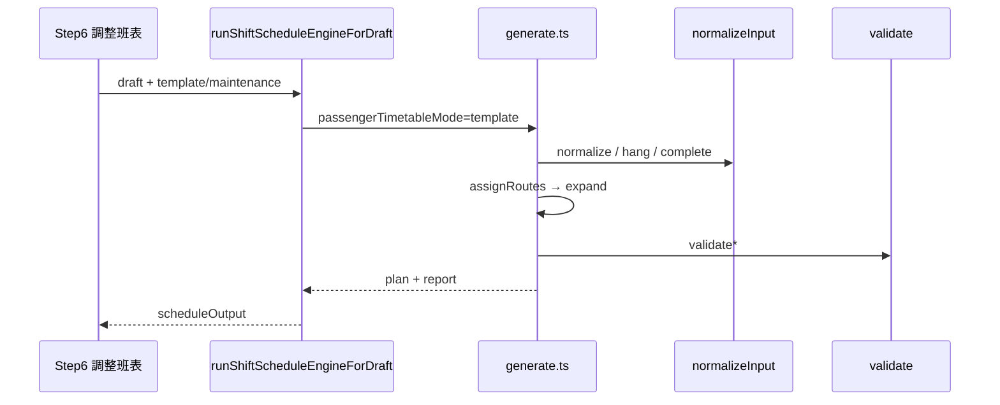

# 排班引擎架構

> 產品入口：[概覽](排班引擎概覽.md)。公式與流水線：[規格](排班引擎規格.md)。

更新日期：2026-07-24

---

## 1. 系統邊界

| 層 | 職責 |
|----|------|
| Wizard UI | 收集 Step 2–4 輸入；Step 6 觸發生成／微調；Step 5 行動設定**不進引擎** |
| Adapter | `runShiftScheduleEngineForDraft.ts`：拉模板／整備 body，呼叫引擎（`template` 模式） |
| 引擎核心 | `schedule-engine/**`：純函式，無 I/O |
| 持久化 | 後端 operation-shift CRUD 保存 `scheduleOutput` |
| 拓撲／leg | `map-editor` 拓撲 + `stationLegTravel.ts` / `buildBlockStationDepartures.ts` |

---

## 2. 目錄

```
frontend/src/features/shift-list/utils/
  runShiftScheduleEngineForDraft.ts   # 生產 adapter
  buildShiftScheduleOutput.ts
  stationLegTravel.ts
  buildBlockStationDepartures.ts
  schedule-engine/
    generate.ts           # 主編排
    normalizeInput.ts     # 正規化、掛車、合併任務
    generateDepartures.ts # 方向班距脈衝
    completeRotationCycles.ts
    assignRoutes.ts
    expand.ts
    validate.ts
    physics.ts
    types.ts
    index.ts              # 對外 re-export
  shiftScheduleEngine.ts  # 相容 re-export（勿當新入口）
```

---

## 3. 核心資料流



Wizard：**Step 6** 觸發引擎；**Step 7** 預覽。

---

## 4. 模組責任

| 模組 | 責任 |
|------|------|
| `normalizeInput` | 解析草稿、方向脈衝、掛車、整備開頭讓渡閘門、呼叫週期補完 |
| `generateDepartures` | 每方向班距脈衝（含跨時段銜接） |
| `completeRotationCycles` | 整輪補完／撤回未成輪去程 |
| `physics` | 恢復＋換線、占用、10s 對齊、折返預算、指紋 |
| `assignRoutes` | 硬輪替指派 |
| `expand` | 寫入 timeline blocks、壓縮整備開頭（鎖尾） |
| `validate` | 重疊、空檔、班距、折返、輪替、時鐘格 |

---

## 5. 改碼落點

| 想改… | 先看 |
|--------|------|
| 班距／掛車／整備開頭讓渡 | `normalizeInput.ts`, `generateDepartures.ts` |
| 恢復／換線／靠站緩衝 | `physics.ts` |
| 整輪來回 | `completeRotationCycles.ts` |
| 路線順序 | `assignRoutes.ts` |
| 區塊裁剪／甘特資料 | `expand.ts` |
| 紅框錯誤 | `validate.ts`, `types.ts`（`FeasibilityViolationCode`） |
| 站間時刻 | `stationLegTravel.ts`, `buildBlockStationDepartures.ts` |
| 地圖拓撲 | `map-editor/utils/pointTopology*.ts` |

---

## 6. 測試層次

| 層 | 指令／位置 |
|----|------------|
| 單元 | `shiftScheduleEngine.spec.ts` 等（見規格） |
| 草稿舉證 | `frontend/scripts/verify-schedule-engine-draft.mjs` |
| UI | Step 6 重新排班、Step 7 可行性與容量圖 |

---

## 相關文件

- [概覽](排班引擎概覽.md)
- [規則](排班引擎規則.md)
- [規格](排班引擎規格.md)
- [算法與策略](排班引擎算法與策略.md)
- [點位拓撲規格](點位拓撲規格.md)
