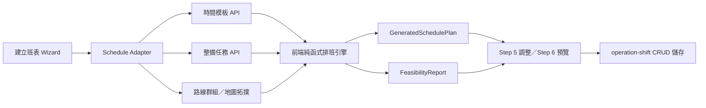
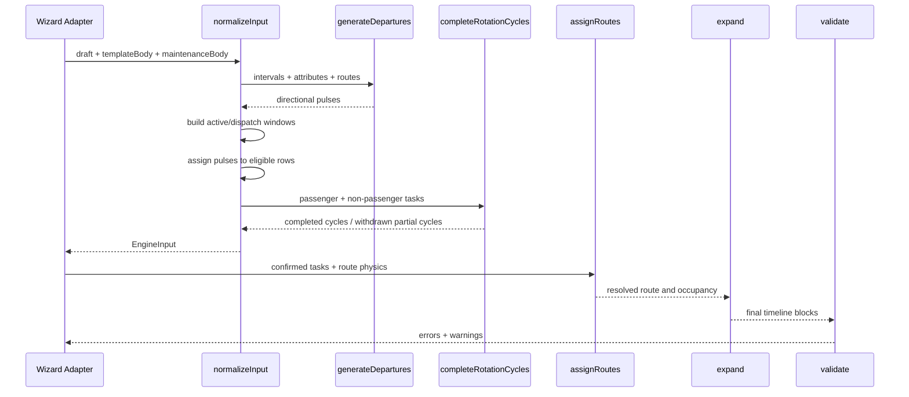

# 排班引擎架構

> 本頁描述現行程式邊界與資料流。產品規則請先讀 [排班引擎設計手冊](排班引擎設計手冊.md)。

## 系統邊界



排班引擎本身：

- 不直接呼叫 API。
- 不讀寫資料庫。
- 不依賴 React。
- 相同輸入應產生相同班表內容；只有 `generatedAt` 是執行時間資訊。

## 目錄

```text
frontend/src/features/shift-list/
├─ components/
│  ├─ CreateShiftSchedulePage.tsx
│  ├─ StepShiftScheduleAdjust.tsx
│  ├─ StepShiftSchedulePreview.tsx
│  ├─ ShiftSchedulePlanGrid.tsx
│  └─ CapacityTrendChart.tsx
├─ utils/
│  ├─ schedule-engine/
│  │  ├─ generate.ts
│  │  ├─ normalizeInput.ts
│  │  ├─ generateDepartures.ts
│  │  ├─ completeRotationCycles.ts
│  │  ├─ assignRoutes.ts
│  │  ├─ physics.ts
│  │  ├─ expand.ts
│  │  ├─ validate.ts
│  │  └─ types.ts
│  ├─ buildCapacityTrend.ts
│  ├─ buildBlockStationDepartures.ts
│  ├─ stationLegTravel.ts
│  └─ shiftScheduleEngine.spec.ts
└─ types/
   └─ create.ts
```

## 核心資料流



## 模組責任

### `generate.ts`

唯一主要入口 `generateShiftSchedule`：

1. 建立 errors / warnings。
2. 呼叫 `normalizeEngineInput`。
3. 檢查折返時限。
4. 解析任務物理量與路線指派。
5. 逐 row 展開最終區塊。
6. 執行所有驗證器。
7. 回傳 plan 與 report。

### `normalizeInput.ts`

負責把產品輸入變成可排任務：

- 解析模板與已選路線。
- 為每條模板正線建立 `ActivePassengerWindow`。
- 以前一整備或相鄰空時段的讓渡餘裕計算 `dispatchStartSecond`。
- 班距脈衝只可依空時段正線讓渡餘裕向後延伸進相鄰空時段開頭，不可提前占用空時段尾端。
- 呼叫每方向脈衝生成器。
- 將脈衝掛到方向、輪替與物理條件均可行的 row。
- 合併非正線任務。
- 呼叫週期補完。

這一層是「能否避免交接缺班」的主要決策位置。

### `generateDepartures.ts`

建立需求側發車脈衝：

- 每個 route/direction 獨立。
- 同一時段按 headway 遞增。
- 跨時段以前後較大班距銜接。
- 所有時刻對齊 10 秒。

它不決定哪台車執行。

### `completeRotationCycles.ts`

檢查每個 row 在整備或日界前是否完成整輪：

- 搜尋合法回程。
- 受同方向班距、同車物理最早、下一任務與整備餘裕共同約束。
- 自動掛車無合法回程時撤回未成輪去程。

### `assignRoutes.ts`

把已掛到 row 的正線任務映射到 route：

- execution order 是硬輪替。
- 計算平均與最快占用。
- 檢查下一錨點與前一班空檔。
- 不為了方便而改變使用者指定的方向順序。

### `physics.ts`

唯一物理公式來源：

- 10 秒格對齊。
- 最低恢復時間。
- 換線緩衝相加。
- 站停與靠站緩衝。
- 路線循環與車隊物理班距下限。

其他模組應呼叫此處函式，不應各自重寫公式。

### `expand.ts`

把任務轉為最終畫面與驗證使用的 block：

- 使用真實路線占用。
- 裁剪整備開頭與尾端。
- 整備被正線占用時鎖住未被占用的另一邊。
- 裁剪完成後才建立 block，避免顯示時間與驗證時間不同。

### `validate.ts`

驗證最終結果，而不是替產生器修班：

- 任務重疊。
- 完整輪替。
- 恢復與換線。
- 車隊物理班距。
- 過密班距與缺班班距。
- 折返與容量。

產生器應先天遵守硬約束；驗證器是最後守門，不是把錯誤班表塗紅後交差。

## PPHPD 資料流


運能圖不讀模板任務橫條長度；只讀最終實際發車。因此交接缺班會真實顯示成 PPHPD 下跌。

## 變更規則時的落點

| 需求 | 優先檢查 |
|---|---|
| 改發車節奏 | `generateDepartures.ts` |
| 改哪些車可在交接時出車 | `normalizeInput.ts` |
| 改完整來回／整備前回程 | `completeRotationCycles.ts` |
| 改恢復、換線、物理公式 | `physics.ts` |
| 改整備如何被正線壓縮 | `expand.ts` |
| 新增最終違規 | `validate.ts`, `types.ts` |
| 改運能圖算法 | `buildCapacityTrend.ts` |

## 測試層次

1. **單元公式**：physics、拓撲 leg、容量換算。
2. **引擎整合**：`shiftScheduleEngine.spec.ts`。
3. **產品草稿回歸**：`verify-schedule-engine-draft.mjs`。
4. **視覺檢查**：Step 5 甘特與 Step 6 PPHPD 趨勢。

任何交接策略變更都至少要驗證：

- 正線開始前預出車。
- 整備尾端被正確裁剪。
- 讓渡上限不被突破。
- 同方向不過密、不缺班。
- 每台車完成整輪。
- 草稿 `ok: true` 且 warnings 為空。

## 相關文件

- [排班引擎設計手冊](排班引擎設計手冊.md)
- [排班引擎規則](排班引擎規則.md)
- [排班引擎規格](排班引擎規格.md)
- [排班引擎算法深度解說](排班引擎算法深度解說.md)
