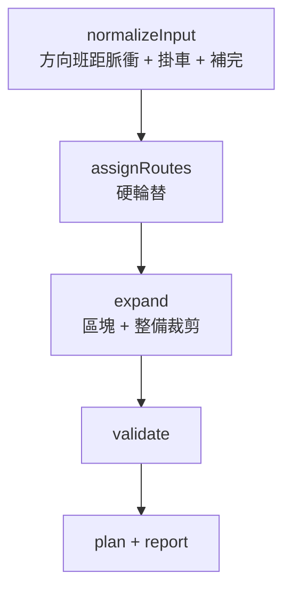

# 排班引擎概覽

<div class="doc-hero">
  <p class="doc-eyebrow">SYNCDRIVE T3 · SCHEDULE ENGINE</p>
  <h2>從時間模板到可執行班表</h2>
  <p>產品語意、Wizard 邊界與文件閱讀地圖。技術細節見規格／規則／算法。</p>
</div>

> **核心原則**
>
> 時間模板的正線區段是「這段時間必須提供正線服務」的營運承諾，不是車輛只能在區段開始後才準備出車的硬邊界。引擎在正線開始前完成必要出車準備，盡可能避免 PPHPD 下跌；硬約束無法同時成立時，不得用違規班次假裝補足運能。

對應程式：`frontend/src/features/shift-list/utils/schedule-engine/`  
生產入口：`runShiftScheduleEngineForDraft.ts`（固定 `passengerTimetableMode: 'template'`）

---

## 閱讀地圖

<div class="doc-grid">
  <a class="doc-card" href="#/排班引擎現行策略">
    <strong>現行策略</strong>
    <span>目前怎麼排、導通輪替怎麼切</span>
  </a>
  <a class="doc-card" href="#/排班引擎約束清單">
    <strong>約束清單</strong>
    <span>關聯圖／站位／備用成對硬約束</span>
  </a>
  <a class="doc-card" href="#/排班引擎可行性驗證清單">
    <strong>可行性驗證清單</strong>
    <span>全部 issue 代號與發生根因</span>
  </a>
  <a class="doc-card" href="#/排班引擎規則">
    <strong>規則</strong>
    <span>營運硬約束與服從矩陣</span>
  </a>
  <a class="doc-card" href="#/排班引擎規格">
    <strong>規格</strong>
    <span>公式、流水線、issue codes、測試</span>
  </a>
  <a class="doc-card" href="#/排班引擎算法與策略">
    <strong>算法與策略</strong>
    <span>S1–S4、掛車、輪替、補完</span>
  </a>
  <a class="doc-card" href="#/排班引擎架構">
    <strong>架構</strong>
    <span>模組邊界與改碼落點</span>
  </a>
  <a class="doc-card" href="#/點位拓撲規格">
    <strong>點位拓撲</strong>
    <span>站間 leg、路線加總、逐站時刻</span>
  </a>
</div>

| 你想… | 讀 |
|------|-----|
| 目前整體怎麼排、圖模式怎麼開 | [現行策略](排班引擎現行策略.md) |
| 硬約束一覽（關聯圖＋站位備用） | [約束清單](排班引擎約束清單.md) |
| 每個 issue 何時出現、怎麼處置 | [可行性驗證清單](排班引擎可行性驗證清單.md) |
| 會跳出哪些驗證、為什麼 | [可行性驗證清單](排班引擎可行性驗證清單.md) |
| 產品怎麼講、約束優先順序 | [規則](排班引擎規則.md) |
| 公式、代號、怎麼測 | [規格](排班引擎規格.md) |
| 引擎怎麼一步步算 | [算法與策略](排班引擎算法與策略.md) |
| 改哪個檔 | [架構](排班引擎架構.md) |
| 地圖拓撲／站間時間 | [點位拓撲規格](點位拓撲規格.md) |

---

## 產品語意

### 時間模板是資源意圖

| 區段 | 意義 |
|------|------|
| 正線 | 應持續提供設定班距與目標運能 |
| 充電／洗車／保養／行前／機動 | 可使用的作業視窗，不代表必須占滿 |
| 空白 | 未排定時間屬性；正線結束後可占用空時段**開頭**（受讓渡餘裕限制），不可提前占用空時段尾端 |

正線優先於整備：可壓縮相鄰整備**開頭**（讓渡餘裕）；保養另可在**尾巴**插入進場載客。仍受輪替、物理占用、恢復、換線、同方向班距等硬約束。

### Wizard 與引擎邊界（7 步）

| 步驟 | 名稱 | 引擎？ |
|------|------|--------|
| 1 | 基本資料 | 否 |
| 2 | 整備任務（含各區段正線優先讓渡餘裕） | 輸入 |
| 3 | 時間模板（含空時段讓渡餘裕） | 輸入 |
| 4 | 路線群組（順序、停靠、緩衝、恢復、拓撲 leg） | 輸入 |
| 5 | 行動設定 | **否**（站間媒體／訊號，不進引擎） |
| 6 | 調整班表 | **在此觸發／重算引擎**；可手動微調後再驗證 |
| 7 | 整體預覽 | 展示結果 |

手動製作與參數生成共用步驟；手動模式不跑自動掛車，但仍可保存行動設定與班次卡。

---

## 輸入／輸出摘要

| 輸入 | 來源 |
|------|------|
| 時間模板 body | Step 3 |
| 整備任務 body + `entrySlackBySection` | Step 2 |
| `emptyIntervalMainlineSlackSeconds` | Step 3（有空時段時） |
| 路線群組、`stationLegTravels`、恢復／換線／靠站緩衝 | Step 4 |
| 折返時限 | 由模板推導 |

| 輸出 | 內容 |
|------|------|
| `GeneratedSchedulePlan` | 各時間線區塊（正線／整備／過渡） |
| `ShiftScheduleFeasibilityReport` | `ok` + errors / warnings |
| 算法 ID | 見 [現行策略 §6](排班引擎現行策略.md)；含導通輪替與執行順序環兩套 |

---

## 流水線（一圖）



細節見 [規格 §3](排班引擎規格.md) 與 [算法與策略](排班引擎算法與策略.md)。

---

## 交接範例（語意）

整備 15:00–16:00、正線自 16:00 開始、讓渡餘裕 600 秒：正線回程最晚可在 16:10 完成並壓縮整備開頭；**不得**在 15:50 為了預熱而裁整備尾端出車。

空時段接在正線之後：回程可占用空時段開頭最多「空時段讓渡餘裕」秒；**不可**在正線開始前的空時段尾端提前出車。

---

## 怎麼驗證

```bash
cd frontend
node --import tsx --test \
  src/features/shift-list/utils/shiftScheduleEngine.spec.ts \
  src/features/shift-list/utils/stationLegTravel.spec.ts \
  src/features/shift-list/utils/buildBlockStationDepartures.spec.ts

node --import tsx scripts/verify-schedule-engine-draft.mjs
```

報告：`frontend/.dev/verify-schedule-engine-report.json`

---

## 已知邊界

1. 無全局回溯：時間線不足時延後或略過脈衝，缺口由 PPHPD／等效班距呈現。
2. 日界內塞不下合法回程 → 撤回尚未成輪的自動去程。
3. `headway` 模式僅供測試／舊路徑；建立班表生產路徑固定 `template`。
