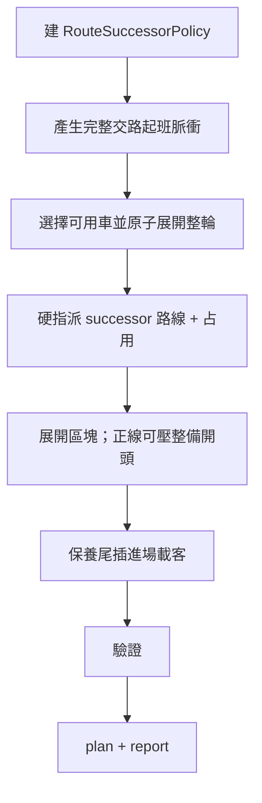

# 排班引擎現行策略

<div class="doc-hero">
  <p class="doc-eyebrow">SYNCDRIVE T3 · CURRENT STRATEGY</p>
  <h2>目前排班怎麼做決定</h2>
  <p>以 Wizard 已確認的輸入為準，說明引擎「為什麼這樣排」與兩種輪替模式如何切換。</p>
</div>

> **一句話**  
> 引擎承諾時間模板上的**正線服務**；車輛必須**成輪**才能進整備或收班；在硬約束內盡量維持班距與運能，做不到就撤未成輪去程，不用違規班次假裝補足。

更新日期：2026-08-03  
對應程式：`frontend/src/features/shift-list/utils/schedule-engine/`  
生產入口：`runShiftScheduleEngineForDraft`（固定 `passengerTimetableMode: 'template'`）

深入公式與代號見 [規格](排班引擎規格.md)；營運條文見 [規則](排班引擎規則.md)；逐步算法見 [算法與策略](排班引擎算法與策略.md)。

---

## 1. 策略目標

| 目標 | 做法 |
|------|------|
| 正線服務連續 | 依各方向班距脈衝掛車；準點掛不上可小幅延後，不可為了掛車裁前一整備尾端 |
| 車輛地理成輪 | 去程之後必須能合法回程（或走完導通參考路徑）才能進整備／收班 |
| 不假裝運能 | 硬約束衝突時撤未成輪去程；缺口由驗證／PPHPD 呈現（`UNSERVED_SERVICE_PULSE` 為警告） |
| 正線優先於整備 | 可占用整備／空時段／**機動**開頭（讓渡餘裕）；保養另可在**尾巴**插進場載客 |
| 班距地板 | 只看候選發車**之前**的同方向班次；不把已掛但更晚的交路中段腿當地板（否則行前出場 TN 會被卡死） |
| 同站折返關節 | 前卡終點＝後卡起點且貼齊時空檔為 0；末站「靠站完成」＝卡尾；下一卡首站只標「出發」＝卡開始（不把上一卡抵達鏡過去；中間有恢復空檔時各自獨立） |

服從順序（摘要）：成輪 → 不重疊 → 恢復＋換線 → 整備切入期限 → 同方向班距 → 在以上之內維持服務。完整矩陣見 [規則](排班引擎規則.md)。

---

## 2. 誰提供什麼參數

引擎只吃 Wizard 已確認的輸入；Step 5 行動設定**不進引擎**。

| 步驟 | 策略相關輸入 |
|------|----------------|
| 2 整備任務 | 整備視窗；各區段 `entrySlackBySection`（正線可偷整備開頭的秒數） |
| 3 時間模板 | 正線／整備／空時段；班距與運能；`emptyIntervalMainlineSlackSeconds`；列數；折返時限由此推導 |
| 4 路線群組 | 路線、停靠、靠站緩衝、換線緩衝、最低恢復時間、**已烘焙的** `stationLegTravels`（來源於地圖編輯／目錄載入時的拓撲 leg） |
| 4 關聯圖 | 有向接續；每條連線為**優先**或**次要**（這是路線層關係，不是軌道路網圖） |
| 4 折返錨點 | 出發／折返站（可複數）；須**鎖定全優先路線組合**才能進下一步（參數化模式） |
| 地圖點位拓撲 | **僅**抽出首班起點站目錄（整備出場 → 可銜接的正線起點）；見 §3.3 |

Step 6 觸發生成；可手動微調後再驗證。手動建表模式不跑自動掛車。

---

## 3. 兩種輪替模式（核心切換）

`normalizeInput` 一開始會建 `RouteSuccessorPolicy`：

```
折返組合已鎖定（指紋仍有效）
且關聯圖有連線
且能算出至少一條全優先路徑
        │
        ├─ 是 → relation-graph-through-anchors-v1（鎖定組合模式）
        ├─ 無關聯圖 → execution-order-ring-v1（僅舊資料相容）
        └─ 有圖但未驗證／已過期 → 停止生成並報錯
```

### 3.1 執行順序環（尚未鎖定折返組合）

- 輪替順序＝Step 4 執行順序（例：下行 → 上行 → …）
- 成輪＝該段正線趟數為**路線數**的整數倍
- 指派／補完算法 ID：`constraint-greedy-v1`、`rotation-cycle-completion-v1`

### 3.2 鎖定折返組合（Step 4 已確認）

- 以已鎖定的**全優先**路徑當輪替環（多條時取週期最短者為「排班採用」）
- 引擎**只**走這組；次要連線僅供關聯圖標示，**不**作為排班備援走法
- 開輪起點對齊折返錨點出發站；整備出場站可對齊對應起點路線
- 折返時限比對也用這組最快一輪秒數（與 Step 4 看板同源）
- 指派／補完算法 ID：`route-assignment-relation-graph-v1`、`rotation-cycle-through-anchors-v1`

> 關聯圖改動、恢復時間、停靠／行駛參數或錨點一變，鎖定指紋失效，須在 Step 4 重新確認；有關聯圖時不得靜默退回執行順序。

### 3.3 路網／點位拓撲：用了什麼、沒用什麼

生成當下會載入**目前班表地圖**（`resolveParsedMapForPlatform`），但**不是**拿整張路網去做即時路徑規劃。

| 項目 | 現行做法 |
|------|----------|
| 載入地圖 | 有；取 `pointTopology` |
| 用途 | `buildMaintenanceFirstTripOriginsFromTopology` → 整備出場站／首班起點對照；開輪相位、進場載客用 |
| 行駛時間 | **不**在生成時重算路網；用 Step 4 路線上已帶的 `stationLegTravels`／avg／min（目錄自地圖烘焙進來） |
| 下一程怎麼選 | Step 4 **已鎖定的全優先折返組合**（關聯圖標示優先／次要；排班只用鎖定全優先） |
| 逐站時刻 | 展開後可依 leg 推站間發到；仍基於已烘焙 leg，不是現場再搜路 |

因此：

- 「車在軌道上怎麼走」→ 地圖編輯／路線群組階段已定好，寫進路線參數  
- 「班表上這一趟接哪一趟」→ 鎖定的折返組合＋班距／成輪約束  
- 引擎**沒有**在排班時重新遍歷 crossover／track 圖找替代實體路徑，也**不會**改走次要連線

若未來要「依即時路網拓撲改交路／重算 leg」，屬擴充，不在現行策略範圍。細節見 [點位拓撲規格](點位拓撲規格.md)。

---

## 4. 引擎怎麼一步步做



### 4.1 完整交路起班脈衝與掛車

- 一個脈衝＝一台車開始一個完整合法交路，不是每個 route leg 各自一個脈衝
- 同服務方向連續 legs（例如 NT→TS）屬同一班；反向 legs 由同車沿 successor chain 自然展開
- 跨時段銜接取 `max(舊班距, 新班距)`（再與車隊物理下限取 max）
- 所有位於正線視窗且能完成整輪的車皆可承接；不再要求所有車從同一固定相位競標
- 準點掛不上：已有同方向前班可延後但不跨下一脈衝；尚無前班最多延 120 秒
- **班距讓路**：用均／壓快仍掛不上、且僅因同方向班距擋住時，可回推已掛的衝突同方向班次（及同輪後續腿），讓正線視窗內的出場／相位對齊車先走；硬約束不滿足則不讓路
- 掛不上會產生 `UNSERVED_SERVICE_PULSE`，不可靜默略過
- **不得**為預出車裁前一整備尾端；空時段不可提前占尾端

算法 ID：`periodic-cycle-headway-v2`

### 4.2 原子化整輪

進整備／收班前必須成輪：

1. 掛車時即沿鎖定 successor chain 展開完整整輪，避免稍後掃描補完造成重複或錯序
2. 中段 leg 依真實換線緩衝接續；折返繞回才計恢復
3. 整輪須在「整備開始 + entrySlack」前完成；可占整備開頭時，整備延後開始且鎖尾
4. 放不下 → 該起班脈衝不掛並留下 issue，不輸出半輪
5. 主路線可行時不走次要／備用路線

### 4.3 路線指派與展開

- 掛車後的正線任務依輪替環**硬指派**路線（不為可行性改方向）
- 一趟占用＝對齊 10 秒格的（有效平均行駛 + 各站有效停靠含靠站緩衝），向下取格（均＝平常參考）；趕班距可壓到快
- 首站停靠不計入占用；途經／不停靠／換線停靠依規則可不計
- 正線可延後整備開始並鎖住原結束時間（壓縮時長）

### 4.4 保養後進場載客

僅**保養（servicing）**尾巴可插「進場載客」短交路：用真實路線把車從出場站接到真正首班起點。

- 計入運能，**不算**輪替
- 必須安全：時間夠、不會追上同路線上一班
- 插不進 → **警告**（非硬錯誤），改由後續輪替接手  
  訊息例：`保養後無可安全插入的進場載客…`

### 4.5 驗證守門（策略／極限／可調）

驗證結果寫入 `FeasibilityReport`。每則議題除 severity 外還有：

| kind | 標籤 | 語意 |
|------|------|------|
| `policy` | 策略說明 | 引擎刻意這樣做（例：進場載客插不進就略過），不是漏填 |
| `limit` | 演算法極限 | 硬約束無法同時成立；引擎已做取捨（撤班／擠班警告） |
| `actionable` | 可調整 | 使用者改 Wizard 參數或班次卡通常有解 |

Step 6 會顯示分類徽章＋**怎麼調整／極限說明**，並可在能對到班次卡時跳轉。  
跨時段班距下限刻意取 `max(兩時段)`；若仍警告，訊息會標出「多半非乾淨脈衝」。

完整代號、根因與嚴重度對照見 **[可行性驗證清單](排班引擎可行性驗證清單.md)**。

---

## 5. 硬約束口訣（S1–S4）

| 代號 | 名稱 | 策略語意 |
|------|------|----------|
| S1 | 恢復 | 同路線或折返繞回須保留最低恢復；導通中段繼任不重複扣 |
| S2 | 換線 | 折返／非繼任：恢復 **+** 換線緩衝；中段繼任：僅換線緩衝 |
| S3 | 對齊 | 發車對齊 10 秒格；占用向下取格且不大於均 |
| S4 | 靠站緩衝 | 各站停靠加固定秒數緩衝（不是百分比） |

```
同路線：下一發車 ≥ 前趟結束 + 恢復
導通中段換線：下一發車 ≥ 前趟結束 + 換線緩衝
折返／非繼任換線：下一發車 ≥ 前趟結束 + 恢復 + 前一路線換線緩衝
```

---

## 6. 算法識別碼一覽

| ID | 何時出現 |
|----|----------|
| `periodic-cycle-headway-v2` | 一律（完整交路起班脈衝＋原子整輪） |
| `execution-order-ring-v1` | 完全沒有關聯圖的舊資料相容 |
| `relation-graph-through-anchors-v1` | 已鎖定全優先組合 |
| `constraint-greedy-v1` | 執行順序硬指派 |
| `route-assignment-relation-graph-v1` | 鎖定組合硬指派 |
| `rotation-cycle-completion-v1` | 執行順序環補完 |
| `rotation-cycle-through-anchors-v1` | 鎖定組合補完（不試次要） |

寫入 `GeneratedSchedulePlan.routeAssignmentAlgorithm`／`timetableGenerationAlgorithm`，供新鮮度與除錯對照。

---

## 7. 已知邊界（現行接受）

1. **有限前視、無整天全局回溯**：不重排整天；掛車時允許同方向班距讓路之局部回推。仍不足則延後或記錄未承接脈衝。
2. **次要連線**：僅關聯圖標示；排班鎖定後**不**走次要備援。
3. **進場載客失敗是警告**：班表仍可 `ok`，需人工檢視保養尾巴與首班間距。
4. **生產路徑固定 `template`**：`headway` 僅測試／次要路徑。
5. **不即時搜路網**：生成時不重跑點位拓撲 shortest-path；行駛與接續依賴 Step 4 已烘焙 leg＋關聯圖（見 §3.3）。

---

## 8. 相關文件

| 文件 | 內容 |
|------|------|
| [概覽](排班引擎概覽.md) | Wizard 邊界與閱讀地圖 |
| [規則](排班引擎規則.md) | 營運硬約束全文 |
| [規格](排班引擎規格.md) | 公式、流水線、issue codes、測試 |
| [算法與策略](排班引擎算法與策略.md) | 掛車／補完逐步細節 |
| [架構](排班引擎架構.md) | 改哪個檔 |
| [點位拓撲規格](點位拓撲規格.md) | leg、路線加總、逐站時刻 |
