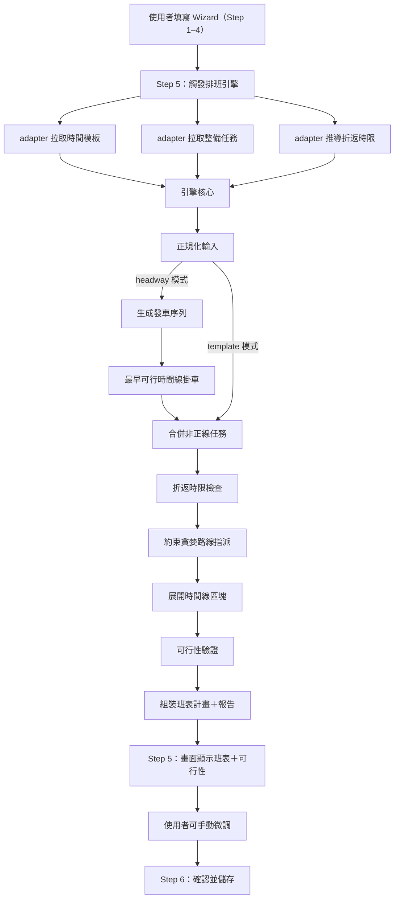
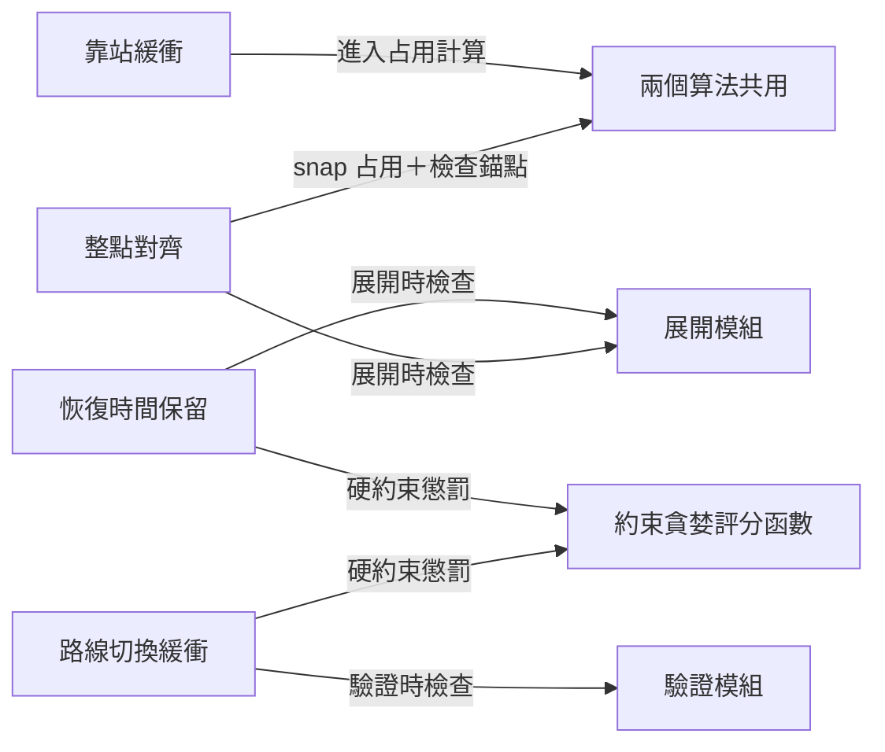

# 排班引擎算法深度解說

## 1. 引擎概述與完成度

排班引擎為前端純函式核心，負責將使用者在 Wizard 中填入的時間模板、路線群組、整備任務等資料，展開為一張完整的正線班表，並附帶可行性報告。

使用者完成 6 步驟 Wizard（基本資料 → 整備任務 → 時間模板 → 路線群組 → 調整班表 → 預覽確認）後，引擎會自動產出包含所有時間線、所有正線班次、過渡段落與可行性報告的完整班表。

### 已完成的能力

| 能力 | 說明 |
|------|------|
| 依班距自動生成所有正線發車時刻 | 週期班距時刻生成算法 |
| 自動分配發車到多條時間線 | 最早可行時間線掛車 |
| 自動指派每趟用哪條路線 | 約束貪婪路線指派算法 |
| 跨車輛自適應交錯排班 | 收集全域正線時段聯集，使多台閒置車輛能輪流交錯跑班距 |
| 強制排班重算與「重新排班」按鈕 | 步驟切換強制清除快取，並在調整頁面提供一鍵重新排班 |
| 甘特圖雙層軌道分軌與過渡隱藏 | 上下雙層分軌（上排模板灰色，下排實際彩色），並過濾隱藏 transition 空置塊 |
| 真實物理占用計算（行駛＋停靠＋緩衝） | physics 模組 |
| 4 大策略閘門 | 恢復時間保留、路線切換緩衝、整點對齊、靠站緩衝 |
| 可行性報告（12 種 issue codes） | error ＋ warning 分級 |
| 手動微調後重新驗證 | 調整班表模組 |
| 整備任務占用計算 | 依整備任務 body 估算占用 |
| 班表持久化與新鮮度偵測 | 參數指紋比對 |

### 已知限制

| 項目 | 影響 |
|------|------|
| 跨時段脈衝對齊（整點網路脈衝） | 多時段班距切換時不做全域脈衝對齊 |
| 全局回溯搜尋 | 貪婪無回溯，極端案例可能次優 |
| 路線指派的 MIP／CP-SAT 升級 | 目前用貪婪足夠，未來可視需求升級 |

---

## 2. 端到端流程



引擎核心是純函式，不直接存取資料庫。Wizard adapter 負責拉時間模板、整備任務等資料送進引擎；引擎只做展開與閘門；後端僅負責 CRUD 保存最終產出。

---

## 3. 四大策略

排班引擎在生成班表時，會嵌入四項策略作為約束。這些策略的目的是**在排班階段就預留必要餘裕**，避免延誤傳染、換線不及、時刻碎裂、站停硬體延遲等問題在營運當下無法吸收。

### 3.1 恢復時間保留

**要解決的問題**：前一趟正線如果晚到幾秒，延遲會一路傳遞給同一車輛後續的所有班次。

**做法**：同一車輛連續兩個班次之間，強制保留一段空檔供吸收小延誤。前一班晚到時，由這段空檔消化，避免延遲往後傳。

**規則**：同一車輛連續兩個班次之間，前一趟結束至下一發車錨點之間，須大於等於設定之恢復時間（預設 30 秒），否則判定不可行。在確認各站停靠時間時，系統會累加所有已選正線路線的最快行駛時間、有效停靠時間（含靠站緩衝）與一組恢復時間。此「完整循環最快時間」不得超過車輛折返時限，否則判定不可行，用以保護實體車輛能安全完成整圈運轉。

**範例**：假設恢復時間設為 30 秒。前一趟計畫結束於 08:10:00，若下一發車錨點為 08:10:20（中間僅 20 秒 < 30 秒）→ 不可行。若下一錨點為 08:10:40（中間 40 秒 ≥ 30 秒）→ 通過。

**嵌入位置**：此策略同時作用於兩個階段——約束貪婪路線指派時作為硬約束懲罰（避免選出導致恢復不足的路線），以及時間線展開與站停確認時作為可行性檢查。

---

### 3.2 路線切換緩衝

**要解決的問題**：同一車輛從路線 A 換到路線 B 時，需要時間做換端、折返或場站作業準備。

**做法**：換路線時強制預留固定準備時間。**同一路線連續兩趟不套用**，只有切換到不同路線時才要求。

**規則**：同一車輛上，連續兩趟正線若分屬不同路線，前一趟結束至下一趟開始之間，須大於等於該路線設定之切換緩衝秒數，否則判定不可行。

**範例**：假設路線 A 切換緩衝設為 60 秒。路線 A 結束於 09:00:00，若下一趟路線 B發車於 09:00:40（中間 40 秒 < 60 秒）→ 不可行。若於 09:01:10 發車（中間 70 秒 ≥ 60 秒）→ 通過。

**嵌入位置**：約束貪婪路線指派時作為硬約束懲罰，以及驗證階段的獨立檢查。

---

### 3.3 整點對齊

**要解決的問題**：如果發車時刻允許任意碎秒（例如 08:10:07），會造成時刻表碎裂，不利於營運管理與自駕秒級控制。

**做法**：計畫時刻須落在固定秒格上，目前格位為 **10 秒**。允許 x 分 00 秒、x 分 10 秒、x 分 20 秒等，不允許任意碎秒。

**規則**：
- 發車錨點換算為自 00:00 起之秒數後，須可被 10 整除，否則判定不可行
- 正線占用秒數計算後，向上取整至 10 秒倍數，確保結束時刻也落在格位上
- headway 模式下，班距秒數自身也向上對齊至 10 秒格，確保所有發車時刻自然落在格位上

**範例**：發車錨點 08:10:00 → 通過。占用原始 137 秒 → 向上對齊為 140 秒，計畫結束落在 10 秒格。若錨點為 08:10:07 → 不可行。

**嵌入位置**：所有占用計算皆通過 `snapUpToClockAlignSeconds` 函式對齊，展開階段檢查錨點是否對齊。

---

### 3.4 靠站緩衝

**要解決的問題**：每一站的開關門等硬體操作有物理延遲，光靠標定停靠時間不夠，需要額外緩衝。

**做法**：每條路線各自設定靠站緩衝百分比。各站有效停靠 = 停靠秒數 × (1 + 緩衝%)，向上取整。緩衝為路線局域參數，不套用全域同一百分比。

**規則**：路線確認停靠與引擎展開占用時，皆使用含緩衝的有效停靠。有效停靠進入一圈時間、折返時限檢查與班表占用長度。

**範例**：停靠 36 秒、緩衝 10% → 有效停靠 = 36 × 1.1 = 39.6 秒 → 向上取整為 40 秒。

**嵌入位置**：從占用計算的源頭就介入——行駛時間 + 有效停靠（含緩衝） = 一趟占用，後續所有計算都基於此。

---

## 4. 算法組成

引擎核心由**兩個算法**串接而成：

| 算法 | 識別碼 | 職責 |
|------|--------|------|
| 週期班距時刻生成 + 最早可行時間線掛車 | `periodic-headway-eat-v1` | 決定「什麼時間發車」＋「掛在哪條時間線」 |
| 約束貪婪路線指派 | `constraint-greedy-v1` | 決定「每趟正線用哪條路線」 |

兩者的串接關係：

```
週期班距時刻生成（生成發車 + 掛車）→ 約束貪婪路線指派（指派路線）→ 展開 → 驗證 → 完整班表
```

---

## 5. 週期班距時刻生成 + 最早可行時間線掛車

### 5.1 發車序列生成

**輸入**：營運時段（例如 08:00–12:00）及其屬性（含班距，例如 600 秒 = 10 分鐘）

**流程**：

1. 將所有營運時段按開始時間排序
2. 對每個時段：
   - 讀取該時段的班距
   - 班距先做整點對齊（例如 65 秒 → 70 秒）
   - 從時段起點開始，以對齊後的班距為間隔，逐一產生發車時刻
   - 時段起點也做整點對齊
   - 發車時刻 ≥ 時段結束時刻時停止

**範例**：時段 08:00–09:00，班距 600 秒

```
08:00:00 → 發車 1
08:10:00 → 發車 2
08:20:00 → 發車 3
08:30:00 → 發車 4
08:40:00 → 發車 5
08:50:00 → 發車 6
（09:00:00 ≥ 結束時刻，停止）
```

### 5.2 最早可行時間線掛車（EAT）

**輸入**：上一步的發車序列、時間線數量、預估一趟占用秒數

**預估占用**：在路線指派之前，無法知道確切用哪條路線，所以取所有候選路線中「平均行駛 + 含靠站緩衝的有效停靠」的最大值，做整點對齊後作為近似占用。路線指派後會用真實占用重新驗證。

**流程**：

1. 建立每條時間線的「釋放時刻」陣列，初始為 0
2. 依時間序遍歷每個發車：
   - 找一條在該發車時刻已空出的時間線
   - 若有多條符合，選最早騰出的那條（讓時間線使用盡量均勻）
   - 掛上去，更新該時間線的釋放時刻 = 發車時刻 + 預估占用
3. **若所有時間線都在忙**（發車時刻時沒有空的車）：
   - 局部修復：把發車延後到最早能騰出的時間線的釋放時刻（做整點對齊）
   - 延後後若超出該發車所屬時段結束 → 跳過此發車
   - 否則掛車

**範例**：2 條時間線，預估占用 1260 秒（21 分鐘），班距 600 秒

```
發車 08:00 → 掛時間線 1（釋放時刻更新為 08:21:00）
發車 08:10 → 掛時間線 2（釋放時刻更新為 08:31:00）
發車 08:20 → 時間線 1 忙到 08:21，時間線 2 忙到 08:31
             → 最早騰出的是時間線 1 在 08:21
             → 延後到 08:21:00（已對齊），掛時間線 1
```

延後發車可能使實際間隔大於設定班距，引擎會以班距警告呈現給使用者。

### 5.3 跨車輛交錯排班與自適應掛車 (Fleet Headway Rotation)

為了解決原先演算法在 headway 模式下，各時間線的正線分配會被死鎖在該時間線原先於模板上配置的正線任務中，造成多車無法在同一時段交錯排班的問題，我們重構了掛載限制判定：

- **限制改以營運時段為準 (Operating Interval Window)**：headway 模式不再把模板上的正線任務橫條當成可發車窗口，而是直接使用時間模板的營運時段與班距屬性生成發車序列。
- **自適應掛載 (Adaptive Line Assignment)**：只要在營運時段內，所有符合「非正線任務不重疊」且「滿足最小恢復時間」的閒置車輛，均可被最早可行時間線掛車 (EAT) 演算法適應地指派正線班次。
- **效果**：這能保證多台車輛在有正線營運需求時，能夠**交錯分配發車、輪流休息與充電**，從而滿足班距，不再會將班次全部擠壓在單一車輛上。

---

## 6. 約束貪婪路線指派

### 6.1 選用貪婪的原因

發車時刻已由週期班距時刻生成鎖定（或由模板錨點鎖定），引擎不能挪動錨點。真正要決策的變數只有：**每一趟正線用哪條路線**。

在目前的場景（路線數 1–5 條、班次數 10–50 趟）下，**貪婪 + 約束懲罰**已能快速得到高品質解，且可解釋性強。未來需要時可升級為局部搜尋或 CP-SAT。

### 6.2 指派流程

對每一時間線，依時間逐趟進行：

```
for 每條時間線（依 row 排序）:
    輪流計數器 = 0
    前一趟路線 = 無
    前一趟結束時刻 = 無

    for 該時間線的每趟正線（依發車時間排序）:
        1. 算出本趟「輪流偏好路線」= 候選路線[輪流計數器 % 路線數]
        2. 對每條候選路線：
           a. 計算占用 = 平均行駛 + 含靠站緩衝的有效停靠 → 整點對齊
           b. 計算評分（見下方評分函數）
           c. 若命中輪流偏好，額外減分（鼓勵輪流）
        3. 選出最佳：可行解優先 → 分數最低 → 執行順序最小
        4. 記錄決策，更新前一趟資訊
        5. 輪流計數器 += 1
```

### 6.3 評分函數

評分愈低愈佳。分為**硬約束**（違反時加大懲罰，使解變得不可行）和**軟目標**（微調偏好）。

#### 硬約束（使方案判定為不可行）

| 條件 | 懲罰 | 意義 |
|------|------|------|
| 占用結束撞上下一趟發車錨點 | 1,000,000 ＋ 重疊秒數 | 物理上不可能：這趟還沒跑完就要發下一趟 |
| 換路線且空檔不足路線切換緩衝 | 800,000 ＋ 不足秒數 | 換線準備不及 |
| 結束後空檔不足恢復時間 | 500,000 ＋ 不足秒數 | 延誤無法吸收 |

懲罰量級由大到小排列，讓算法在「全部不可行」時仍能選出「最不嚴重」的方案。

#### 軟目標（微調偏好）

| 條件 | 分數調整 | 意義 |
|------|---------|------|
| 符合本趟輪流偏好 | −100 | 強烈鼓勵按設定的執行順序輪流 |
| 同路線連續（不用換線） | −5 | 微幅鼓勵連續以減少換線次數 |
| 空檔充裕度 | ＋(120 − 空檔秒數) | 鼓勵適度空檔，太緊加分 |
| 換路線（有切換緩衝） | ＋40 ＋ 切換緩衝 × 0.1 | 換線有成本 |
| 執行順序 | ＋順序 × 2 | 低順序路線微幅優先 |
| 已使用次數 | ＋次數 × 15 | 負載均衡：用太多次的路線加分 |
| 占用長度 | ＋占用秒 / 60 | 占用短的路線微幅優先（破平手用） |

### 6.4 評分範例

假設有 2 條路線：**路線 A**（執行順序 1，切換緩衝 60 秒）和**路線 B**（執行順序 2，切換緩衝 0 秒）。本趟輪流偏好是路線 A。前一趟使用路線 A，空檔 80 秒。

**候選：路線 A（同路線連續）**

| 項目 | 計算 | 得分 |
|------|------|------|
| 空檔充裕度 | 120 − min(80, 120) = 40 | ＋40 |
| 同路線連續 | | −5 |
| 輪流偏好命中 | | −100 |
| 執行順序 | 1 × 2 | ＋2 |
| 已使用 3 次 | 3 × 15 | ＋45 |
| 占用 1260 秒 | 1260 / 60 | ＋21 |
| **小計** | | **＋3（可行）** |

**候選：路線 B（換路線）**

| 項目 | 計算 | 得分 |
|------|------|------|
| 空檔充裕度 | 120 − min(80, 120) = 40 | ＋40 |
| 換線成本 | 40 ＋ 60 × 0.1 = 46 | ＋46 |
| 輪流偏好未命中 | | 0 |
| 執行順序 | 2 × 2 | ＋4 |
| 已使用 2 次 | 2 × 15 | ＋30 |
| 占用 1260 秒 | 1260 / 60 | ＋21 |
| **小計** | | **＋141（可行）** |

**結果**：選路線 A（分數 3 遠低於 141），符合「連續同路線＋按輪流偏好」的設計意圖。

### 6.5 最終決策邏輯

```
若有可行解也有不可行解 → 選可行解
若有多個可行解 → 選分數最低的
若分數相同 → 選執行順序最小的
若全部不可行 → 仍選分數最低的，交由後續驗證報錯
```

---

## 7. 策略與算法的嵌入關係

策略並不是獨立的後處理，而是**深度嵌入**算法的各個階段：



算法在做決策的當下就已經考慮了所有策略約束，而不是先排好再事後檢查。

---

## 8. 班表產出結構

引擎產出的班表計畫包含以下結構：

| 欄位 | 說明 |
|------|------|
| 時間線陣列 | 每條時間線上的所有區塊 |
| 每個區塊的任務類型 | 正線（passenger）、空閒（idle）等 |
| 被指派的路線 | routeId ＋ routeName |
| 原始發車錨點 | 模板或班距生成的理想發車時間 |
| 計畫開始／結束時間 | 實際排入班表的時刻 |
| 行駛秒數 | 該路線的平均行駛時間 |
| 含緩衝停靠秒數 | 各站有效停靠加總 |
| 區塊來源 | template_bar（實際任務）或 transition（過渡段） |
| 路線指派算法識別碼 | `constraint-greedy-v1` |
| 時刻生成算法識別碼 | `periodic-headway-eat-v1`（headway 模式） |

同時附帶可行性報告：

| 欄位 | 說明 |
|------|------|
| ok | 全部閘門是否通過 |
| errors | 不可行項目清單（必須修正才能使用） |
| warnings | 警告項目清單（可接受但需留意） |

---

## 9. 整體算法複雜度

| 階段 | 複雜度 | 說明 |
|------|--------|------|
| 發車序列生成 | O(D) | D＝發車總數，由時段長度 / 班距決定 |
| 最早可行時間線掛車 | O(D × T) | T＝時間線數，每趟掃一遍時間線 |
| 約束貪婪路線指派 | O(D × R) | R＝路線數，每趟評估所有路線 |
| 展開 | O(D) | 逐趟展開 |
| 驗證 | O(D × T ＋ D²) | 重疊檢查 ＋ 班距檢查 |

在典型場景（D≈50 趟, T≈3 條時間線, R≈3 條路線）下，整體為毫秒級，使用者幾乎不會感到等待。
