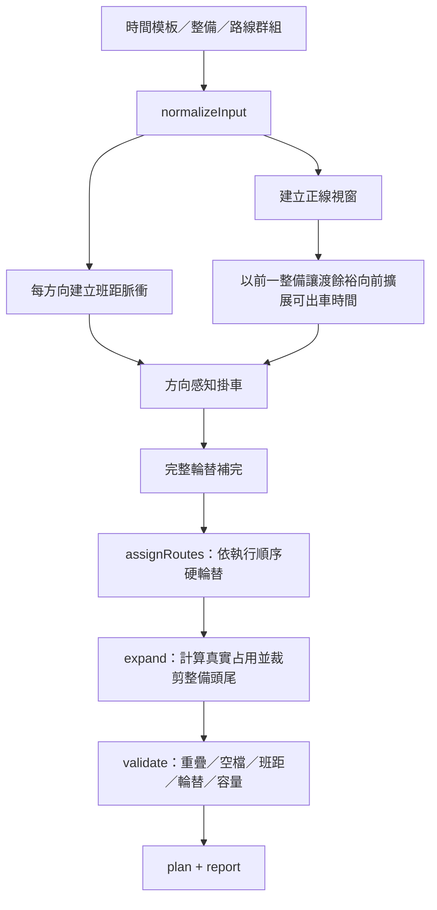

# 排班引擎設計手冊

<div class="doc-hero">
  <p class="doc-eyebrow">SYNCDRIVE T3 · SCHEDULE ENGINE</p>
  <h2>從時間模板到可執行班表</h2>
  <p>產品語意、規則、約束、演算法、架構、範例與驗證的單一入口。</p>
</div>

> **核心原則**
>
> 時間模板中的正線區段是「這段時間必須提供正線服務」的營運承諾，不是車輛只能在區段開始後才準備出車的硬邊界。引擎必須反推交接，在正線開始前完成必要出車準備，盡可能避免 PPHPD 下跌。

## 閱讀地圖

<div class="doc-grid">
  <a class="doc-card" href="#/排班引擎規則">
    <strong>規則</strong>
    <span>營運者與驗證器共同遵守的條款</span>
  </a>
  <a class="doc-card" href="#/排班引擎規格">
    <strong>規格</strong>
    <span>資料、公式、硬約束與輸出契約</span>
  </a>
  <a class="doc-card" href="#/排班引擎算法深度解說">
    <strong>演算法</strong>
    <span>脈衝、掛車、輪替、補完與驗證</span>
  </a>
  <a class="doc-card" href="#/排班引擎架構">
    <strong>架構</strong>
    <span>模組邊界、資料流與維護入口</span>
  </a>
</div>

## 1. 產品語意

### 1.1 時間模板是資源意圖

時間模板描述每條時間線在各區段允許或期望執行的工作：

- **正線**：該區段應持續提供設定班距與目標運能。
- **充電、保養、洗車、行前、機動**：可使用的作業視窗，不代表必須占滿整段。
- **空白**：未排定時間屬性的時段；正線結束後可在「空時段正線讓渡餘裕」內占用空時段開頭，不可提前占用空時段尾端。

正線是主要營運任務。整備是支援正線的彈性視窗，因此交接時採「正線優先、整備鎖邊壓縮」。

### 1.2 正線優先不是無限制覆蓋

正線可以占用相鄰整備的頭尾，或相鄰空時段，但仍受以下限制：

1. 不得超過班表 Step 2 該整備區段的正線優先讓渡餘裕（`entrySlackBySection`）。
2. 占用空時段時不得超過班表 Step 3 的空時段正線讓渡餘裕（`emptyIntervalMainlineSlackSeconds`）。
3. 不得跨越不相鄰的空白區或另一個任務。
4. 車輛仍須符合完整輪替、物理占用、恢復、換線與同方向班距。
5. 若所有硬約束無法同時成立，不得用違規班次假裝補足運能。

## 2. 輸入與輸出

| 輸入 | 主要內容 | 來源 |
|---|---|---|
| 時間模板 | 時段、班距、載運量、時間線、正線與整備視窗 | 建立班表 Step 3 |
| 空時段正線讓渡餘裕 | 有未覆蓋屬性時段時必填；預設 600s | 建立班表 Step 3 |
| 整備任務 | 作業參數、設施、作業時間（不含讓渡策略） | 建立班表 Step 2 選取 |
| 正線優先讓渡餘裕 | 各整備啟用區塊分別設定；預設 600s | 建立班表 Step 2 |
| 路線群組 | 執行順序、拓撲行駛時間、停靠、恢復與換線緩衝 | 建立班表 Step 4 |
| 班表設定 | 模板、整備任務、路線群組的綁定與調整 | 建立班表 Wizard |

引擎輸出：

- `GeneratedSchedulePlan`：每條時間線的正線、整備與過渡區塊。
- `ShiftScheduleFeasibilityReport`：`ok`、`errors`、`warnings`。
- 演算法識別碼：便於持久化、除錯與結果追溯。

## 3. 規則優先順序

當規則互相競爭時，依下列順序決策：

1. **完整輪替**：出車後必須依路線群組順序完成整輪。
2. **物理可行**：同車不得重疊，行駛與停靠時間不得被憑空壓縮。
3. **作業空檔**：恢復時間與換線緩衝必須相加。
4. **整備讓渡上限**：正線不得超過整備可讓渡餘裕。
5. **同方向安全班距**：不得短於時段要求與車隊物理下限。
6. **正線服務連續**：在以上硬約束內，優先補齊班距脈衝，避免 PPHPD 下跌。
7. **整備利用率**：使用剩餘整備時間，不為填滿整備而犧牲正線。

「避免 PPHPD 下跌」是強優化目標；若因硬約束確實無法達成，最終 PPHPD 趨勢與等效班距必須如實呈現缺口，不得用模板目標線假裝達成。

## 4. 核心公式

### 4.1 正線占用

```text
有效平均行駛時間 =
  stationLegTravels 完整 ? Σ(leg.avg) : route.avgTravelTimeSeconds

有效停靠時間 = Σ(站點停靠 + 該路線靠站緩衝)

一趟占用秒數 =
  向上對齊 10 秒(有效平均行駛時間 + 有效停靠時間)
```

### 4.2 同車下一趟最早發車

```text
同路線：
  next ≥ previousEnd + recovery

切換路線：
  next ≥ previousEnd + recovery + previousRoute.switchBuffer
```

恢復與換線緩衝是不同作業，必須相加，不得取較大值。

### 4.3 同方向班距

```text
requiredHeadway =
  max(
    前班所在時段班距,
    本班所在時段班距,
    車隊物理班距下限
  )

nextSameDirection ≥ previousSameDirection + requiredHeadway
```

車隊物理班距下限：

```text
向上對齊 10 秒(單車最短一趟占用 / 可用時間線數)
```

### 4.4 運能

```text
pphpd(direction) = vehicleCapacity × 3600 / 實際同方向班距秒數
```

圖表以實際發車計算，不以模板目標線假裝達成。兩個方向分別換算後取平均，並以 10 分鐘分桶及鄰近平滑顯示。

## 5. 正線與整備交接

### 5.1 一個設定、兩個邊界

班表 Step 2 的 `entrySlackBySection`（產品文案「正線優先讓渡餘裕」）預設 600 秒，依整備區段分別設定。它對整備兩側分別生效：

| 邊界 | 行為 | 上限 |
|---|---|---|
| 正線 → 整備 | 已合法開出的完整輪可占用整備開頭；整備延後開始、原結束鎖定 | 最多餘裕秒數 |
| 整備 → 正線 | 引擎可提早結束整備並提前出車，使正線視窗開始時已有服務能力 | 最多餘裕秒數 |

兩側是各自的交接約束，不是共用一個總秒數池。

### 5.1.1 空時段正線讓渡餘裕

班表 Step 3 的 `emptyIntervalMainlineSlackSeconds`（僅模板有屬性空時段時出現）預設 600 秒：

| 邊界 | 行為 | 上限 |
|---|---|---|
| 正線 → 空時段開頭 | 開新輪／回程可占用空時段開頭 | 最多餘裕秒數 |
| 空時段尾端 → 正線 | **禁止**提前占用空時段尾端出車 | — |

```text
latestCycleEnd（後接空時段）=
  serviceEnd + emptyIntervalSlack

dispatchStart（前接空時段）= serviceStart   // 不提前
```

### 5.2 整備尾端預出車

若正線視窗 `serviceStart` 前緊接一段整備：

```text
dispatchStart =
  max(
    previousMaintenance.start,
    serviceStart - previousMaintenance.slack
  )
```

班距脈衝可在 `[dispatchStart, serviceEnd)` 內掛到該車。實際首班一旦確定，前一整備結束時間裁到首班發車時刻。

這代表車輛可以在正線區段開始前先跑去程；到 `serviceStart` 時，車隊已進入穩定下行／上行輪替，而不是從零開始暖機。

### 5.3 整備開頭讓渡

在正線視窗尾端開新輪時：

```text
完整輪結束 ≤ nextMaintenance.start + nextMaintenance.slack
```

符合才可發車。若不符合，撤回尚未成輪的自動去程，不得留下只有去程的車。

### 5.4 為什麼不能要求每台車整點同時出發

時間模板要求的是**車隊服務能力**，不是每條時間線同時啟動。同方向多車同時發車會違反班距，也會造成虛高 PPHPD。

交接最佳化的目標是：

- 該方向每一個班距脈衝都有人承接；
- 新車可在前一整備尾端開始預出車；
- 到正線視窗起點時，車隊已形成交錯輪替；
- 不要求 row1、row2、row3 同時在整點發同方向。

## 6. 完整輪替鐵則

假設路線群組執行順序為「下行 → 上行」：

```text
合法：D → U
合法：D → U → D → U
非法：D → 整備
非法：D → 收班
```

跨正線視窗時，上一視窗必須先完成整輪；下一視窗從新的完整輪邊界開始。若自動班次無合法回程：

1. 先嘗試在班距、物理空檔與整備餘裕內補回程。
2. 無法補完時，撤掉該輪尚未完成的自動去程。
3. 不得把違規回程推到下一個正線視窗，也不得留下車在對側終點。

## 7. 演算法流水線



### 7.1 每方向班距脈衝

演算法識別碼：`periodic-directional-headway-eat-v1`

- 下行與上行各自建立發車序列。
- 跨時段第一脈衝不得短於 `max(舊班距, 新班距)`。
- 發車時刻與占用均對齊 10 秒格。
- 固定脈衝只是需求骨架；整備交接的預出車視窗決定哪些車可提早承接。

### 7.2 方向感知掛車

對每個脈衝掃描所有時間線，候選車必須同時符合：

1. 位於該車可出車視窗。
2. 輪替索引正好輪到此方向。
3. 同車已完成前趟占用、恢復與換線。
4. 同方向不低於目標與物理班距。
5. 開新輪時能在下一整備讓渡上限內完成。

候選評分優先順序：

```text
延後秒數 → 發車時刻 → 該車前次釋放時刻
```

因此先準點、再選較早可用的車。跨整備視窗會把輪替索引推進到下一完整輪邊界。

### 7.3 路線指派

演算法識別碼：`constraint-greedy-v1`

現在的路線指派不是自由選路線，而是依使用者設定的 execution order 硬輪替。評分只用於可行性診斷與破平手；不得為了塞班而交換方向。

### 7.4 週期補完

演算法識別碼：`rotation-cycle-completion-v1`

補完回程的搜尋下限取：

```text
max(
  同車物理最早時間,
  上一班同方向 + 所需班距
)
```

搜尋上限同時受下一整備讓渡截止、同車下一班、24:00 日界限制。

### 7.5 展開與裁剪

`expand` 會：

- 用真實路線物理量建立正線區塊；
- 正線吃整備開頭時，延後整備開始並鎖住原結束；
- 預出車吃整備尾端時，提早整備結束；
- 只裁剪被占用的整備，不平移後續任務；
- 裁剪完成後才建立最終區塊，確保畫面與驗證使用相同時間。

## 8. 16:00 與 19:00 範例

### 8.1 16:00：300 秒脈衝相位

原本 14:00–17:00 的下行脈衝受跨時段較嚴班距影響，形成：

```text
... 15:48、15:53、15:58、16:03、16:08 ...
```

若把 16:00 當成硬性最早出車邊界，16:00 沒有脈衝，只能等 16:03，造成 PPHPD 凹洞。

新規則允許 16:00 前相鄰保養尾端讓渡 600 秒。完成保養的車可承接 15:53、15:58 等脈衝，保養提早結束；到 16:00 時車隊已在輪替，實際 300 秒班距不中斷。

### 8.2 19:00：多車整備交接

19:00 有 180 秒脈衝，但所有 19:00 完成保養的車若都從下行新一輪開始，回程方向要等一趟占用加恢復後才會出現，容易少掉一個上行脈衝。

新規則讓部分車在 19:00 前 10 分鐘內承接下行脈衝。它們在 19:00 左右已可接上行；其他車再承接 19:00、19:03 後的下行，形成平滑交錯，而不是整點後逐車暖機。

### 8.3 驗收結果

模擬正線草稿 `OS-DRAFT-MRDW9ZKY`：

| 區間 | 目標班距 | 實際趨勢 |
|---|---:|---:|
| 15:50–16:10 | 300 秒 | 840 PPHPD，等效班距 300 秒 |
| 18:50–19:10 | 180 秒 | 1400 PPHPD，等效班距 180 秒 |

同時必須維持 `ok: true`、0 errors、0 warnings。

## 9. 驗證與錯誤代號

| 代號 | 層級 | 意義 |
|---|---|---|
| `ROTATION_CYCLE_INCOMPLETE` | error | 未完成路線群組整輪 |
| `TIMELINE_OVERLAP` | error | 同車任務重疊 |
| `RECOVERY_INSUFFICIENT` | error | 恢復時間不足 |
| `ROUTE_SWITCH_BUFFER_INSUFFICIENT` | error | 恢復加換線空檔不足 |
| `HEADWAY_PHYSICAL_IMPOSSIBLE` | error | 同方向發車短於車隊物理下限 |
| `HEADWAY_BELOW_TARGET` | warning | 實際班距短於模板班距，發車過密 |
| `INSUFFICIENT_TIMELINES` | warning | 車數可能不足以維持目標班距 |
| `CLOCK_ALIGN_VIOLATION` | error | 時刻未落在 10 秒格 |
| `ANCHOR_CONFLICT` | error | 正線物理占用撞上下一正線 |
| `TURNAROUND_LIMIT_EXCEEDED` | error | 最快折返仍超過限制 |
| `STATION_LEG_TRAVEL_INVALID` | error | 拓撲站間時間非法 |

可用班表的最低門檻是 `report.ok === true`；營運交付前還應要求 warnings 為空。

## 10. 程式架構

| 模組 | 職責 |
|---|---|
| `generate.ts` | 主入口、流水線編排、組裝 plan/report |
| `normalizeInput.ts` | 解析模板、建立可出車視窗、預出車、方向感知掛車 |
| `generateDepartures.ts` | 每方向班距脈衝 |
| `completeRotationCycles.ts` | 完整輪替補完與撤回 |
| `assignRoutes.ts` | 路線執行順序硬輪替、物理占用決策 |
| `physics.ts` | 對齊、恢復、換線、停靠與物理班距 |
| `expand.ts` | 建立最終區塊、裁剪整備頭尾 |
| `validate.ts` | 重疊、班距、輪替、折返與容量驗證 |
| `buildCapacityTrend.ts` | 由最終實際發車計算 PPHPD |

完整資料流與相依關係見 [排班引擎架構](排班引擎架構.md)。

## 11. 測試與草稿驗證

```bash
cd frontend
node --import tsx --test \
  src/features/shift-list/utils/shiftScheduleEngine.spec.ts
```

草稿驗證：

```bash
cd frontend
node --import tsx scripts/verify-schedule-engine-draft.mjs
```

交接案例至少覆蓋：

- 整備尾端 600 秒內可預出車。
- 預出車後整備尾端確實裁到首班開始。
- 讓渡餘裕為 0 時不得提前。
- 同方向班距不過密也不缺班。
- 16:00 與 19:00 PPHPD 不產生交接凹洞。
- 所有車仍完成整輪，且無任務重疊。

## 12. 已知邊界

1. 現行是可解釋的方向感知貪婪掛車，沒有全局回溯或 CP-SAT。
2. 正線優先不能突破完整輪替、物理班距與整備讓渡上限。
3. 若車數或讓渡餘裕不足，可能無法達成目標 PPHPD；此時應回報警告並由使用者調整模板、車數或整備配置。
4. 拓撲路線快照寫入班表草稿後，不會因地圖後續修改自動更新。

## 相關文件

- [排班引擎規則](排班引擎規則.md)
- [排班引擎規格](排班引擎規格.md)
- [排班引擎策略](排班引擎策略.md)
- [排班引擎算法深度解說](排班引擎算法深度解說.md)
- [排班引擎架構](排班引擎架構.md)
- [點位拓撲規格](點位拓撲規格.md)
